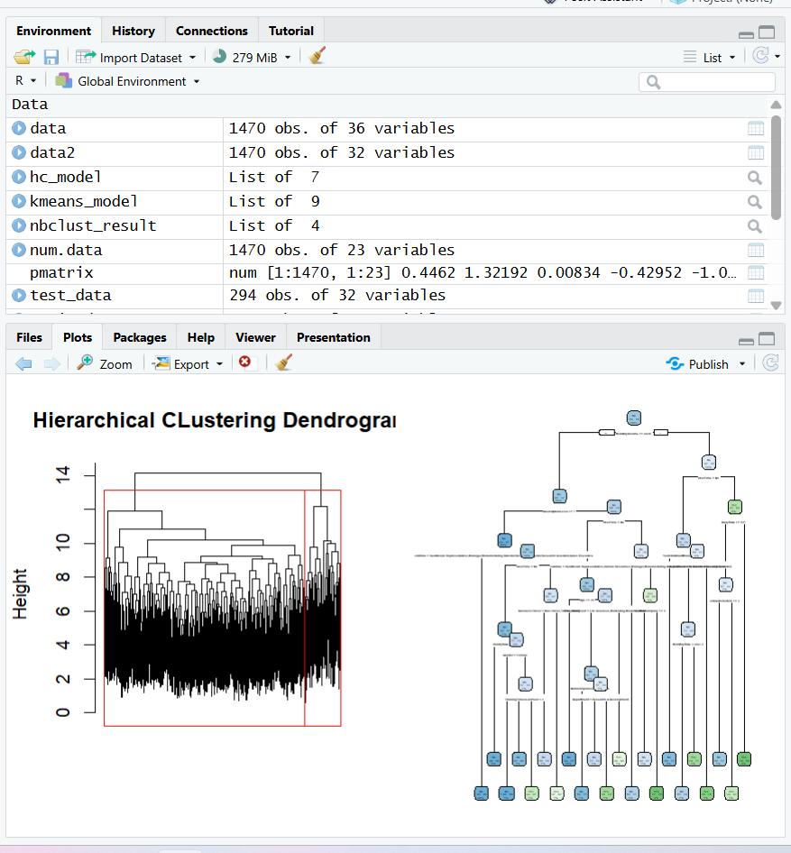
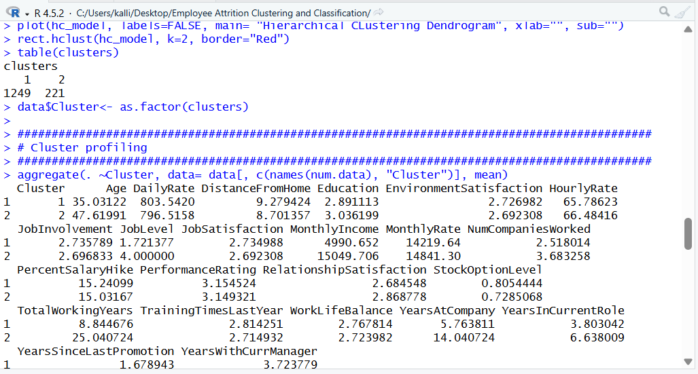
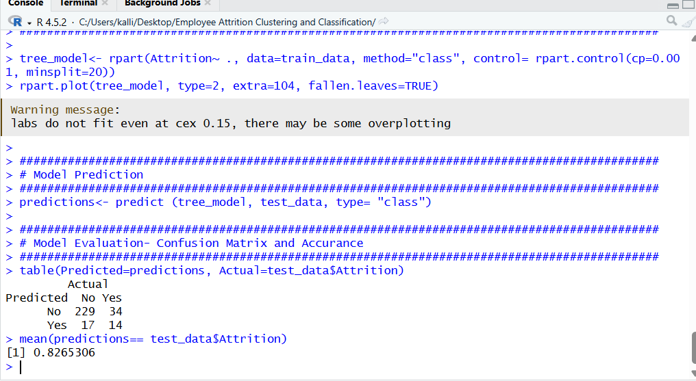
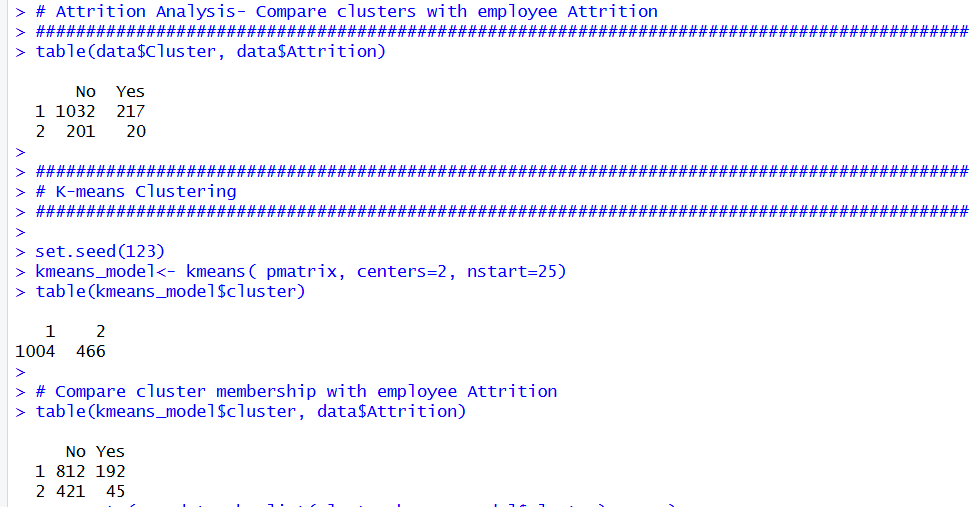

# IBM HR Employee Attrition Analysis

## Overview

This project analyzes the IBM HR Employee Attrition dataset using machine learning techniques in R.

The objective is to identify groups of employees with similar characteristics and investigate factors related to employee attrition.

## Dataset

- IBM HR Analytics Employee Attrition Dataset
- 1,470 employees
- 35 variables

## Methods

- Hierarchical Clustering
- NbClust
- K-Means Clustering
- Decision Tree Classification
- Train/Test Split (80/20)
- Confusion Matrix Evaluation

## Tools

- R
- NbClust
- rpart
- rpart.plot

## Project Structure

- `employee_attrition_analysis.R` – R source code
- `IBM_HR_Employee_Attrition_Analysis.pdf` – Project report
- `WA_Fn-UseC_-HR-Employee-Attrition.csv` – Dataset
- `output/` – Figures generated during the analysis

## Key Findings

- Two distinct employee groups were identified.
- Younger employees with lower experience showed a higher probability of attrition.
- Hierarchical Clustering and K-Means produced very similar results.
- The Decision Tree identified variables such as OverTime, Monthly Income and Age as important predictors of employee attrition.

## Author

Kalliopi Sakellariou

## Output

### Hierarchical Clustering and Decision Tree

### Cluster Profiling

### Confusion Matrix

### NbClust Results

### Hierarchical Clustering and K-means Comparison with Attrition

Improve README
